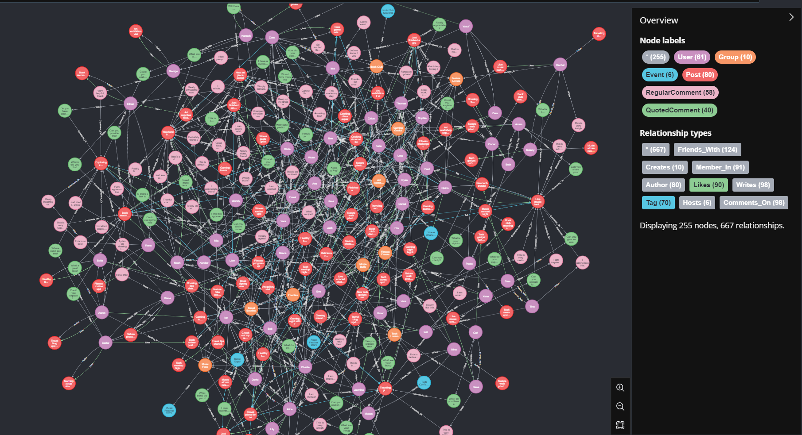
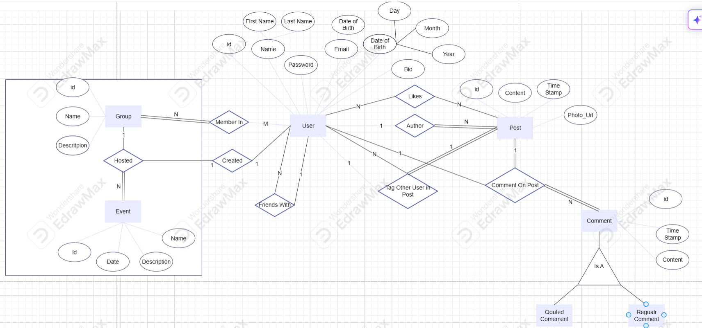

# Social Media Application with Neo4j

## Overview
This repository contains a Social Media Application prepared for my final project of Advanced Database Course in IUST.
It includes cypher queries along with Asp.Net Core Web API application for connection to Neo4j via [Neo4j.Driver](https://github.com/neo4j/neo4j-dotnet-driver).

This is data in Neo4j:



ERD:



## Structure
- **Cypher**: Contains Cypher scripts for inserting data and queries in Script folder.
- **C#**: Contains C# projects and code for interacting with Neo4j.

## Getting Started
To get started with this repository, follow the steps below:

### Prerequisites
- Neo4j installed or Docker installed if using Docker to run Neo4j.
- .NET SDK if working with C# projects.

### Installation
1. Clone the repository:
    ```sh
    git clone https://github.com/MrSEKIRO/Neo4j.git
    cd Neo4j
    ```

2. Set up Neo4j:
    - If using Docker:
        ```sh
        docker-compose up -d
        ```
    - If using a local installation, ensure Neo4j is running.

### Usage
- **Cypher Scripts**: Navigate to the Script directory and run the desired scripts using the Neo4j browser or command line.
- **Configuration Setup**: Check Neo4j configuration in appsetting.json file.
- **C# Projects**: Open the project in your preferred IDE and run the application.

## Contributing
Contributions are welcome! Please fork the repository and create a pull request with your changes.

## License
This project is licensed under the MIT License.

## Contact
For questions or support, please open an issue in this repository.
